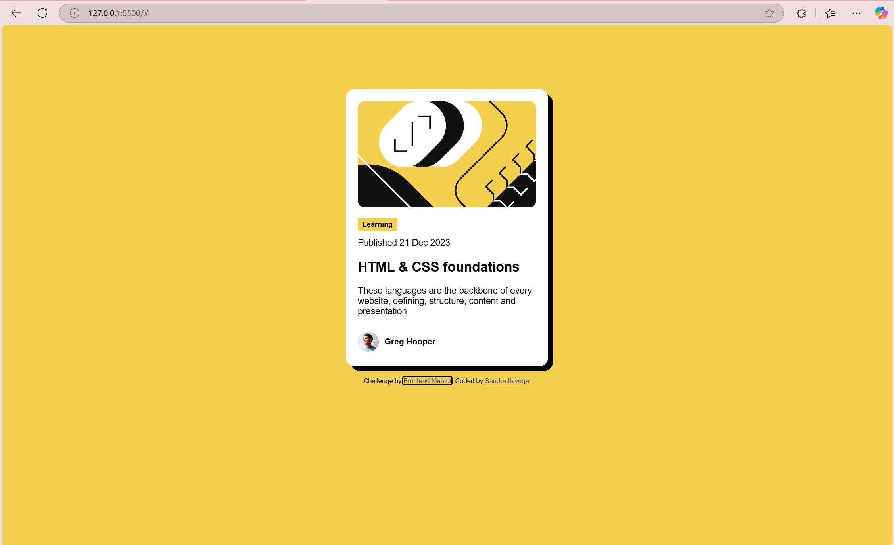

# Frontend Mentor - Blog preview card solution

This is a solution to the [Blog preview card challenge on Frontend Mentor](https://www.frontendmentor.io/challenges/blog-preview-card-ckPaj01IcS). Frontend Mentor challenges help you improve your coding skills by building realistic projects. 

## Table of contents

- [Overview](#overview)
  - [The challenge](#the-challenge)
  - [Screenshot](#screenshot)
  - [Links](#links)
- [My process](#my-process)
  - [Built with](#built-with)
  - [What I learned](#what-i-learned)
  - [Continued development](#continued-development)
  - [Useful resources](#useful-resources)
- [Author](#author)
- [Acknowledgments](#acknowledgments)

**Note: Delete this note and update the table of contents based on what sections you keep.**

## Overview

### The challenge

Users should be able to:

- See hover and focus states for all interactive elements on the page

### Screenshot



### Links

- Solution URL: (https://github.com/Ilavoga/blog-preview-card.git)
- Live Site URL: (https://ilavoga-blog-post-card.netlify.app/)

## My process

### Built with

- Semantic HTML5 markup
- CSS custom properties
- Flexbox
- CSS Grid


### What I learned

The project helped me practice and reinforce several key frontend skills. Here are some of the major 
skills I learned:

-How to use Flexbox to center elements both vertically and horizontally

```
body {
  display: flex;
  justify-content: center;
  align-items: center;
  height: 100vh;
}
```
-How to use @font-face to import a custom font locally from the assets folder:

```
@font-face {
  font-family: 'Figtree';
  src: url('./assets/fonts/Figtree-VariableFont_wght.ttf') format('truetype');
}
```

## Author

- Website - [Ilavoga](https://ilavoga-blog-post-card.netlify.app/)
- Frontend Mentor - [@Ilavoga](https://www.frontendmentor.io/profile/Ilavoga)
- X/Twitter - [@WhosS4ndr4](https://x.com/WhosS4ndr4)


## Acknowledgments

I would like to thank Frontend Mentor for providing a platform where I can practice and improve my skills!


